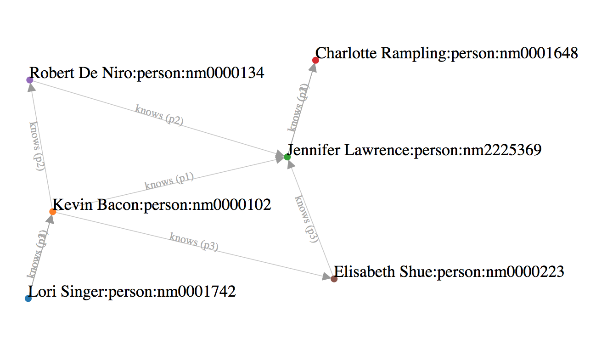

# [azure-cosmosdb-101-workshop](WORKSHOP.md)

#  CosmosDB with Graph Data, Gremlin, TinkerPop

# Terminology

- Vertices
- Edges
- Properties

- [Apache TinkerPop Framework](http://tinkerpop.apache.org/)
- [Gremlin Graph Traversal Language](http://tinkerpop.apache.org/gremlin.html)

# Example - Six Degrees of Kevin Bacon

# Implementation - Six Degrees of Kevin Bacon

## [Repo azure-cosmosdb-graph](https://github.com/cjoakim/azure-cosmosdb-graph)
